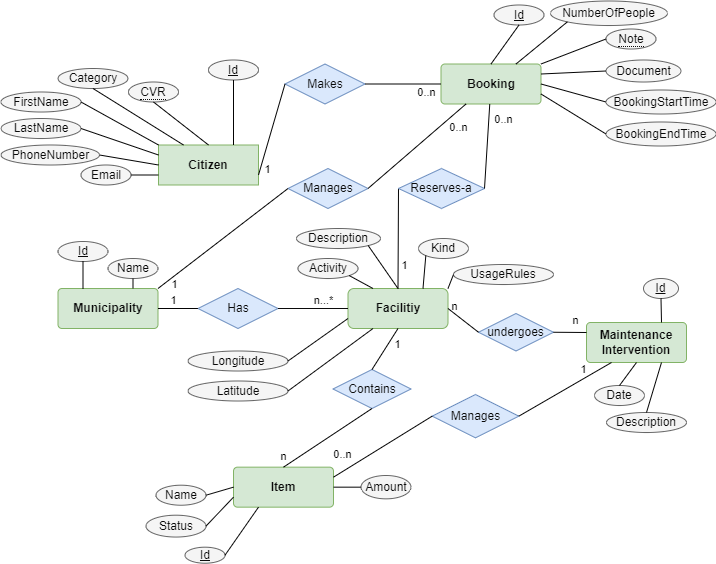

## Consolidation
From the four diagrams that the groupmembers created in the first hand-in a new consolidated model has been created and can be viewed below.

Not all designs had the items as a table so this has been added. Furthermore the Municipality has also been added, along with some improvements regarding relationships between the entities.

## Implementation
The items are just implemented as an attribute of type string to the facility model instead of adding a new model item.
The municipality has also not been implemented.
