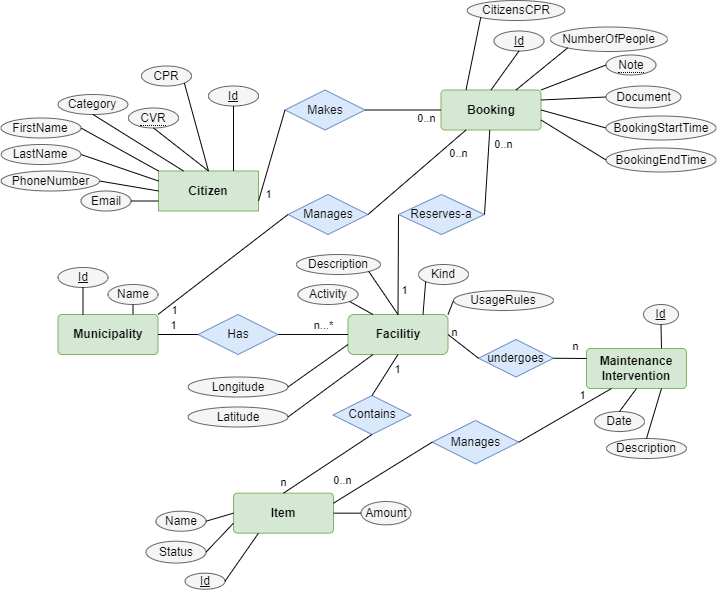

## After new requrements
Below is shown the ER diagram after new requirements has been added.

## Implementation
The property CPR is added to the citizen and a foreign key reference to this is added to the booking for citizen. 
Maintance history is a global on that has a key to what facility is was done at, but the facility does not know about the maintance table. 