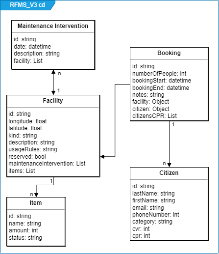

# Reflections

## Embedding vs Reference

we embedded items in facilities as they only exist on facility and never alone. The booking also had both facility and citizen document embedded. Lastly the MaintenanceIntervention has embedded a facility document.

## De-normalizesation and data storage

We have made the choice to have different collection for Facility, Booking, Citizen and MaintenanceIntervention documents.

Compared to the former implementation using SQL we found that the logical schema could be simplfied.

We chosse not to do any de-normalisation.

## Logical schema

